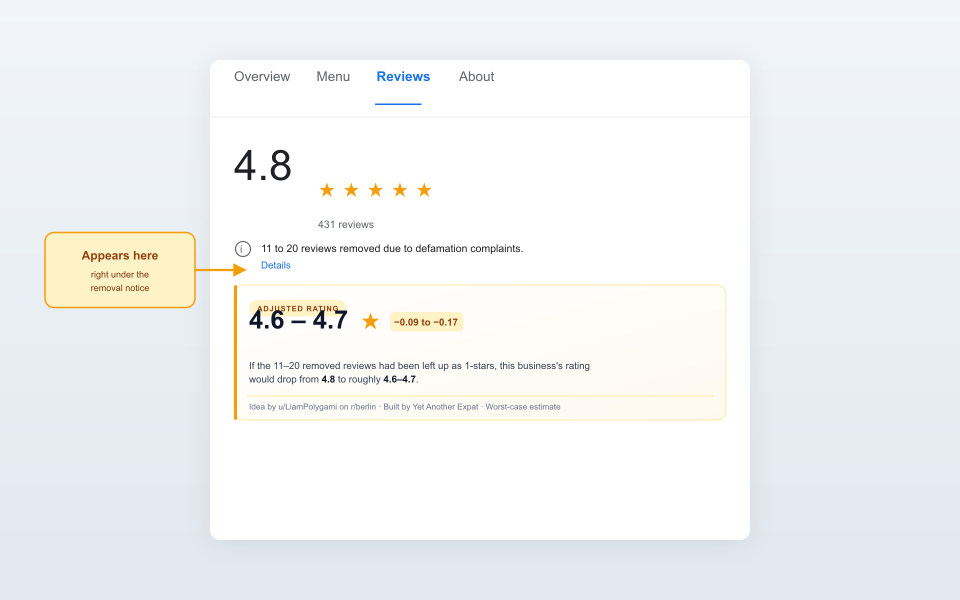

# Fair Rating — German Review Removal Adjuster

A tiny Chrome extension that shows you the **real** rating of a business on Google Maps after accounting for reviews that were removed under German defamation law.

<p align="center">
  
</p>

<p align="center">
  <a href="https://chromewebstore.google.com/detail/fair-rating-%E2%80%94-german-revi/fpmekdnlhkcldbheplomiehpgpondgpn"><strong>Install for Chrome</strong></a> ·
  <a href="https://addons.mozilla.org/firefox/addon/fair-rating-german-reviews/"><strong>Install for Firefox</strong></a> ·
  <a href="https://ennui92.github.io/fair-rating-extension/">Website</a> ·
  <a href="CHANGELOG.md">Changelog</a> ·
  <a href="https://ennui92.github.io/fair-rating-extension/privacy.html">Privacy policy</a> ·
  <a href="https://github.com/Ennui92/fair-rating-extension/issues">Report an issue</a>
</p>

## Why does this exist?

In Germany, businesses can file defamation complaints to get negative Google reviews removed. Some use this aggressively — dozens or hundreds of critical reviews get wiped, and their star rating stays artificially high.

Google recently started displaying a notice like **"21 to 50 reviews removed due to defamation complaints"** on affected businesses — but the visible star rating doesn't change. This extension fixes that: it reads the notice, treats every removed review as a 1-star rating (configurable), and shows you the adjusted rating.

**Example:** A restaurant shows `4.8 ★ (431 reviews)` with `11 to 20 removed`. Fair Rating shows its true rating is closer to `4.6–4.7` — a `−0.09 to −0.17` drop. That might not sound like much, but when hundreds of reviews were removed it can mean half a star or more.

Works on Google Maps in ~20 languages — English, German, Greek, Spanish, French, Italian, Portuguese, Dutch, Polish, Russian, Turkish, Czech, Swedish, Hungarian, Japanese, Chinese and more.

---

## Install

### Recommended: install from your browser's store

- [**Add to Chrome — free**](https://chromewebstore.google.com/detail/fair-rating-%E2%80%94-german-revi/fpmekdnlhkcldbheplomiehpgpondgpn) (also works on Brave, Edge, Arc, and any other Chromium-based browser)
- [**Add to Firefox — free**](https://addons.mozilla.org/firefox/addon/fair-rating-german-reviews/) (Firefox 140+ desktop, Firefox for Android 142+)

One click on either store.

### Manual install (if you prefer to load from source)

For people who've never installed a Chrome extension manually, it takes ~60 seconds:

### 1. Download this project

- Click the green **Code** button near the top of this page
- Click **Download ZIP**
- Unzip the file somewhere you'll remember (e.g. your Documents folder)

You should now have a folder containing `manifest.json`, `content.js`, etc.

### 2. Open Chrome's extensions page

- Open Google Chrome (or Brave, Edge, Arc — any Chromium-based browser)
- In the address bar, type: `chrome://extensions` and hit Enter

### 3. Turn on Developer mode

- In the top-right of the extensions page, flip the **Developer mode** toggle to ON

### 4. Load the extension

- Click **Load unpacked** (top-left)
- Navigate to the folder you unzipped in step 1
- Select the folder (the one that contains `manifest.json`) and click **Select folder**

### 5. Try it out

- Open [Google Maps](https://www.google.com/maps) and search for a business that's been in the news for removing reviews (in Berlin: try "Amrit Friedrichshain" or "Risa Chicken")
- Click the **Reviews** tab
- You should see an amber **Adjusted rating** card right under the defamation notice

If nothing appears, the business probably hasn't had any reviews removed — which is a good sign for them.

---

## Settings

Click the extension's icon in your browser toolbar (pin it first via the puzzle-piece icon if you don't see it). The popup lets you change how harshly removed reviews are counted:

- **0 stars** — most punitive, matches the original Reddit suggestion
- **1 star** (default) — worst case within Google's 1–5 scale
- **2 stars** — mildly negative
- **3 stars** — neutral

Changes apply on the next page refresh.

---

## How the math works

```
adjusted_rating = (current_rating × total_reviews + assumed_star × removed) / (total_reviews + removed)
```

Google reports removed reviews as a **range** (e.g. "11 to 20"). The badge shows the rating range using both the low and high end of that range. The adjusted rating always floors to 1 decimal, so we never round up in the business's favour.

### Capped banners ("more than 250 reviews removed")

Google caps the disclosed range. When the notice shows the top bucket, the upper bound is estimated as `max(500, total_reviews × 5%)` — small businesses that hit the cap get at least 500, and large businesses get a proportionally larger estimate. The badge labels this clearly as "250+ (extrapolated to ~N)" so the reader knows the number is an estimate, not from Google.

### Caveats

- The count only covers the **last 365 days** — if a business has been abusing this for years, the cumulative effect is worse.
- This is a rough worst-case estimate, not a verified rating.

---

## Credits

- **Idea**: [u/LiamPolygami](https://www.reddit.com/user/LiamPolygami/) in a [r/berlin thread](https://www.reddit.com/r/berlin/) about Google's new defamation-removal disclosure — *"Someone needs to create an extension that adds 0 ratings for every removed rating and then averages that with the provided rating."*
- **Built by**: [About me](https://open.spotify.com/show/7ibAqCfRRWJmUiWIRyTeWD)

---

## Roadmap

- [x] Chrome Web Store listing — [live](https://chromewebstore.google.com/detail/fair-rating-%E2%80%94-german-revi/fpmekdnlhkcldbheplomiehpgpondgpn)
- [x] Firefox / AMO listing — [live](https://addons.mozilla.org/firefox/addon/fair-rating-german-reviews/) (Firefox 140+ / Firefox for Android 142+)
- [ ] Mobile (Google Maps app) — not currently possible from a browser extension; the Maps mobile app does not load extensions. Mental shortcut for app users: subtract roughly 0.25 to 0.5 stars from any business displaying the defamation-removal notice (per a Reddit reader's suggestion).
- [ ] Optional inline display (next to the big rating number instead of a separate card)
- [x] User-tunable multiplier for historical removals — auto-detects from oldest visible review, with a global default in the popup (v1.0.7)

See [CHANGELOG.md](CHANGELOG.md) for the version-by-version history.

---

## Development

The extension is a handful of files:

- `manifest.json` — Manifest V3 extension config
- `content.js` — finds the defamation notice on Google Maps, parses rating/total/removed, injects the badge
- `styles.css` — badge styling
- `popup.html` / `popup.css` / `popup.js` — settings popup
- `icons/` — toolbar icons at 16, 32, 48, 128 px
- `icon.svg` — source icon
- `docs/` — GitHub Pages site (landing page + privacy policy) and promo assets
- `tools/build-assets.mjs` — generates all PNGs from `icon.svg`

No build step for the extension itself. Edit the source files, reload the extension at `chrome://extensions`, refresh the Maps tab.

To regenerate store/promo graphics: `cd tools && node build-assets.mjs`

## License

MIT. Do whatever you want with it.
